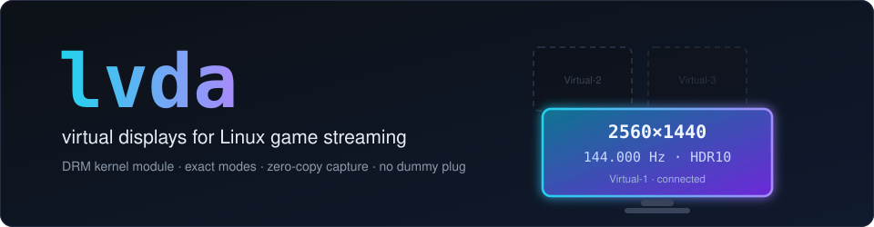
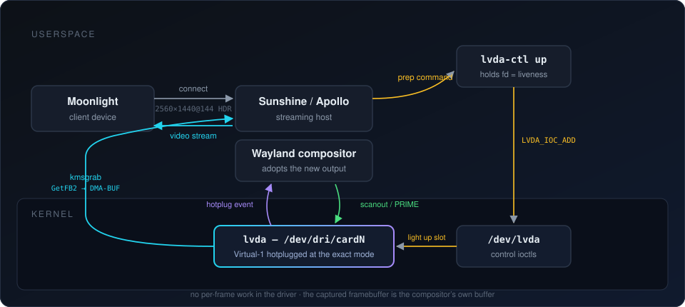

<p align="center">
  
</p>

<p align="center">
  <a href="https://github.com/barak14/lvda/actions/workflows/ci.yml"></a>
  <a href="LICENSE"></a>
  
</p>

`lvda` gives a Linux game-streaming host a real, hotpluggable display that
matches each client **exactly** — no dummy plug, no EDID firmware hacks, no
fixed list of pre-baked modes.

It is a DRM kernel module exposing a persistent, display-only virtual card
(`/dev/dri/cardN`) that carries a pool of virtual monitors. The monitors start
*disconnected*, like unplugged ports on a real GPU. A control ioctl on
`/dev/lvda` lights one up at an exact resolution, refresh rate, and HDR mode,
and hotplug-connects it. The Wayland compositor adopts the new output like any
physical monitor; a streaming host (Sunshine / Apollo) captures it and serves
Moonlight at the client's native mode.

<p align="center">
  
</p>

## Highlights

- **Exact modes.** The requested `width × height @ refresh` (millihertz
  precision, up to 8192 px and 1000 Hz) is synthesized straight into the
  monitor's EDID. The compositor sees one native mode — the client's.
- **Hotplug on demand.** Monitors connect when the stream starts and vanish
  when it ends, driven by ordinary DRM hotplug events.
- **Zero-copy capture.** The driver does no per-frame work. The compositor
  scans out to the virtual monitor; capture reads that same buffer via
  `drmModeGetFB2()` → DMA-BUF → encoder. PRIME-imported render-GPU buffers
  scan out directly — no CPU copy anywhere.
- **Crash-proof lifetime.** A monitor lives exactly as long as the `/dev/lvda`
  fd that created it. Kill the owner by any means and the kernel reaps the
  display — no stale state survives.
- **Deterministic identity.** EDID bytes are a pure function of the client id
  and mode, so the compositor recognizes the "same" monitor across sessions
  and keeps its settings.
- **HDR-ready.** One flag declares HDR10/PQ + BT.2020 + 10-bit in the EDID;
  another advertises 10-bit for SDR.

## Quick start

```sh
./build.sh                          # build the native DKMS package...
sudo pacman -U packaging/arch/*.pkg.tar.zst   # ...install with the command it prints
sudo modprobe lvda                  # autoloads at boot from then on
sudo gpasswd -a "$USER" lvda        # /dev/lvda is root:lvda 0660; re-login

lvda-ctl up --width 2560 --height 1440 --fps 144
#   -> added: /dev/dri/card0 connector=Virtual-1 monitor_id=0 client_id=...
```

`./build.sh` detects your distro (Arch, Debian/Ubuntu, Fedora/RHEL/openSUSE,
Gentoo, NixOS) and dispatches to the matching packaging recipe.

To serve every Moonlight client at its native mode, wire a flagless do/undo
pair into Sunshine — `lvda-ctl` reads the client's mode from the
`SUNSHINE_CLIENT_*` environment:

```conf
global_prep_cmd = [{"do": "/usr/bin/lvda-ctl up --pidfile /run/lvda/sunshine.pid", "undo": "/usr/bin/lvda-ctl down --pidfile /run/lvda/sunshine.pid"}]
```

## Documentation

| Page | What's inside |
|---|---|
| [Building & installing](BUILD.md) | Kernel requirements, per-distro packages, manual install, module signing, permissions, uninstall |
| [How it works](docs/architecture.md) | DRM topology, monitor lifecycle, EDID synthesis, zero-copy scanout, observability, ABI |
| [`lvda-ctl` reference](docs/lvda-ctl.md) | Commands, every flag and env fallback, the daemon/liveness model, scripting outputs |
| [Sunshine / Apollo integration](docs/sunshine.md) | Prep commands, KMS capture, output targeting, HDR, multi-client streaming |
| [Troubleshooting](docs/troubleshooting.md) | Permission errors, missing monitors, laggy streams, verifying the zero-copy path |
| [Validation results](docs/validation.md) | Where lvda has been run end to end, and what the test suites cover |

## Inspecting state

```sh
lvda-ctl status                              # protocol version + running daemons
cat /sys/class/drm/card0-Virtual-1/status    # connected | disconnected
sudo cat /sys/kernel/debug/dri/0/monitors    # whole-card table: slot, mode, flags, owner
```

## Repository layout

| Path | Contents |
|---|---|
| `module/` | The kernel module (kbuild) |
| `uapi/` | Userspace ABI header — single source of truth |
| `tools/lvda-ctl/` | The CLI / liveness daemon |
| `tests/` | Host-built EDID conformance + `/dev/lvda` integration tests |
| `packaging/` | DKMS packaging for Arch, Debian, RPM, Gentoo, Nix + shared drop-ins |
| `docs/` | Architecture, CLI, integration, and troubleshooting guides |

## License

GPL-2.0 — see [LICENSE](LICENSE).
