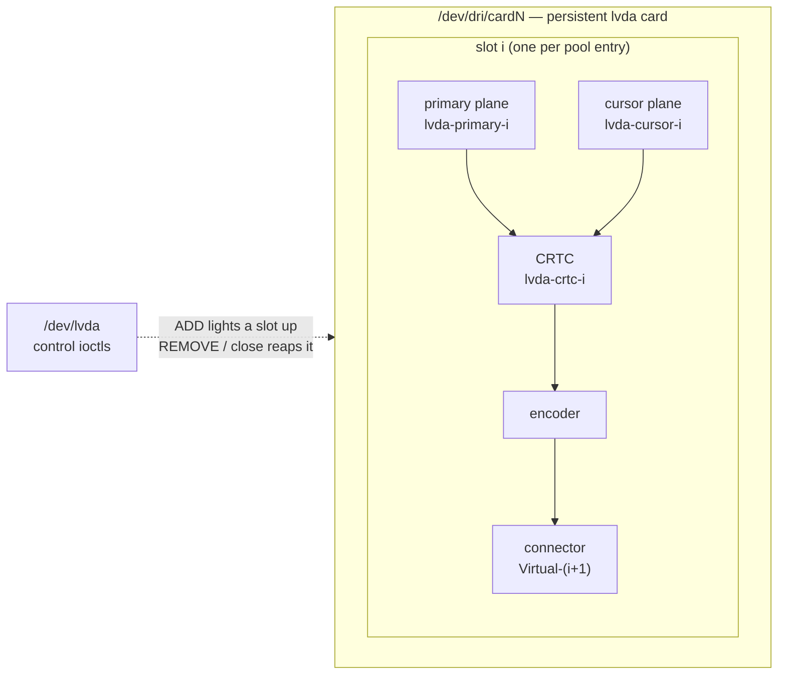
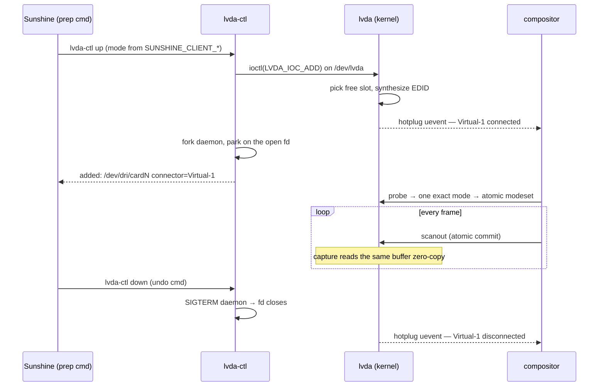

# How lvda works

lvda splits into a **control plane** and a **display plane**:

- `/dev/lvda` — a miscdevice taking three ioctls (`ADD`, `REMOVE`, `VERSION`).
  This is where monitors are created and destroyed.
- `/dev/dri/cardN` — one persistent, display-only DRM card. It registers once
  at module load and never re-registers; monitors come and go as *hotplug
  events* on its connectors, exactly like cables on a physical GPU.

The split matters: compositors enumerate DRM cards at session start and react
badly to whole cards appearing and disappearing. A persistent card whose
connectors flip between `connected` and `disconnected` is the path every
compositor already handles well.

## DRM topology

The card carries `lvda_max_monitors` (module param, 1..32, default 1)
identical slots. Each slot is a full, statically allocated DRM pipe:



- **Primary plane** — accepts LINEAR buffers always, plus any injected
  scanout modifiers (see [zero-copy](#zero-copy-scanout-and-capture)). No
  scaling: the framebuffer must match the mode.
- **Cursor plane** — up to 256×256 ARGB. The compositor moves the hardware
  cursor without re-compositing the whole frame, and capture composites it
  into the stream.
- **Connector** — `DRM_MODE_CONNECTOR_VIRTUAL`, named `Virtual-1` …
  `Virtual-N`. Reports `disconnected` until a monitor is up; while up, its
  probe returns exactly one mode — the requested one.

## Monitor lifecycle

A monitor is owned by the `/dev/lvda` file description that added it. The open
fd **is** the liveness signal — there is no heartbeat, no watchdog, no state
file to go stale.



`close(2)` on the owning fd — explicit `down`, daemon killed, process crash,
OOM kill, anything — triggers `lvda_release_owner()`, which reaps every
monitor that fd added and fires the disconnect hotplug event. A monitor can
never outlive its owner.

## EDID synthesis

Each `ADD` synthesizes a complete EDID for the requested mode
(`module/lvda_edid.c`, kernel-agnostic — the same code builds into the host
test harness):

- The exact timing is generated with **CVT-RB** and placed as the preferred
  detailed timing descriptor. Timings whose pixel clock exceeds the DTD limit
  are carried in a **DisplayID extension** instead.
- `LVDA_F_HDR` declares HDR10/PQ + BT.2020 + 10-bit; `LVDA_F_10BPC`
  advertises 10-bit color for SDR.
- The 16-byte **client id** keys the monitor's EDID identity (vendor/serial).
  EDID bytes are a *pure function* of `(client_id, width, height, refresh,
  flags, physical size, name)` — no randomness, no state. The same client at
  the same mode always produces byte-identical EDID, so the compositor
  recognizes the monitor across sessions and keeps its scale, position, and
  color settings.

Golden vectors for the synthesizer live in `tests/host/vectors/`; the
conformance suite (`tests/host/test_edid`) compiles `lvda_edid.c` directly on
the host.

## Zero-copy scanout and capture

The driver never touches pixels. Three paths keep it that way:

1. **Compositor-allocated dumb buffers** (software rendering or fallback):
   LINEAR shmem buffers scan out as-is.
2. **PRIME import**: the card accepts dma-bufs exported by a render GPU, so
   the compositor can place a hardware-rendered buffer on the virtual monitor
   directly. The captured framebuffer re-exports as that same GPU buffer —
   the encoder reads video memory the render GPU wrote, with no copy in
   between.
3. **Injected scanout modifiers**: the primary plane always advertises
   LINEAR; to let the compositor scan out *tiled* render-GPU buffers, inject
   that GPU's format modifiers at load time:

   ```sh
   make -C tests/host scanout_modifiers_probe && tests/host/scanout_modifiers_probe
   #   -> options lvda scanout_modifiers=0x...,0x...
   ```

   The probe runs on the render GPU, filters its modifiers to single-plane
   layouts lvda can accept, and prints a ready-made `modprobe.d` line. Write
   it to `/etc/modprobe.d/lvda.conf` and reload the module.

Capture (Sunshine `kms`, ffmpeg `kmsgrab`) reads the live scanout buffer via
`drmModeGetFB2()` → DMA-BUF and hands it to the encoder. It needs
`CAP_SYS_ADMIN`, not DRM master — it never conflicts with the running
compositor.

## Observability

| Where | What |
|---|---|
| `lvda-ctl status` | Protocol version + every rendezvous daemon and whether it is alive |
| `/sys/class/drm/cardN-Virtual-M/status` | `connected` / `disconnected` per slot |
| `/run/lvda/card` | Card minor + connector name of the last `up`, for scripting |
| `/sys/kernel/debug/dri/N/monitors` | Whole-card table: slot, state, mode, flags, generation, connector, EDID length, client id (root, debugfs mounted) |
| `/sys/kernel/debug/dri/N/state` | Stock DRM atomic state: which CRTC is active, at what mode, scanning out whose framebuffer, `imported=yes/no` |

```
# cat /sys/kernel/debug/dri/0/monitors
slot state  mode                flags       gen  connector    edid client_id
0    active 2560x1440@120.000   hdr,10bpc   1    Virtual-1    128  deadbeef000000000000000000000000
```

`imported=yes` on the primary plane in `state` means the PRIME zero-copy path
is in use; `imported=no` means the compositor is handing lvda its own shmem
buffers (CPU copy on the render side).

## Stable ABI

`uapi/lvda.h` is the single source of truth, installed as
`/usr/include/lvda/lvda.h`. The module includes it — never re-declares it.
Struct sizes are locked by `_Static_assert`; the protocol version
(`lvda-ctl status` reports it) bumps on every ABI change.

Request bounds enforced at the ioctl:

| Field | Range | Notes |
|---|---|---|
| `width`, `height` | 1 – 8192 px | out of range → `EINVAL` |
| `refresh_mhz` | 1 000 – 1 000 000 mHz | 1–1000 Hz, millihertz precision; pixel clock beyond even DisplayID → `EOVERFLOW` |
| `phys_{width,height}_mm` | 0, or 10 – 2550 mm | 0 derives from pixel count at 96 DPI; rounded to EDID 1 cm granularity |
| `name` | ≤ 13 chars | EDID monitor-name descriptor capacity |
| `client_id` | 16 bytes | keys EDID identity |
| `flags` | `LVDA_F_HDR`, `LVDA_F_10BPC` | |
