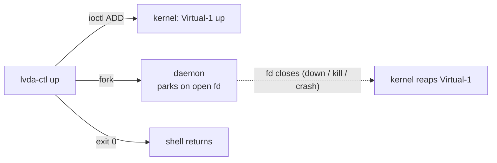

# `lvda-ctl` reference

```
usage: lvda-ctl <command> [options]
  up   [--width N] [--height N] [--fps N] [--hdr] [--10bit]
       [--phys-width-mm N] [--phys-height-mm N] [--name S]
       [--client-id <32hex>] [--pidfile P] [--card-out P]
  down --pidfile P
  status
```

## The daemon model

`lvda-ctl up` opens `/dev/lvda`, issues `LVDA_IOC_ADD`, and forks a tiny
daemon that parks on the open fd, then returns to the shell. **The fd is the
liveness signal**: when it closes — via `down`, or because the daemon died
with the session, a crash, or a kill — the kernel reaps the monitor. No
watchdog, no heartbeat, no state to clean up.



The daemon terminates on `SIGTERM`, `SIGINT`, or `SIGHUP`; `down` sends
`SIGTERM` to the pid recorded in `--pidfile`. If the daemon is already gone,
`down` removes the stale pidfile and reports success — the desired state is
the current state.

## `up`

Adds a monitor and prints one line for scripting:

```
added: /dev/dri/card0 connector=Virtual-1 monitor_id=0 client_id=9f86d081884c7d659a2feaa0c55ad015
```

Every setting resolves **CLI flag → `SUNSHINE_CLIENT_*` environment variable →
default**, so a bare `lvda-ctl up` inside a Sunshine prep command picks up the
connecting client's mode automatically:

| Flag | Env fallback | Default |
|---|---|---|
| `--width N` | `SUNSHINE_CLIENT_WIDTH` | 1920 |
| `--height N` | `SUNSHINE_CLIENT_HEIGHT` | 1080 |
| `--fps N` | `SUNSHINE_CLIENT_FPS` | 60 |
| `--hdr` | `SUNSHINE_CLIENT_HDR` | off |
| `--10bit` | `SUNSHINE_CLIENT_10BPC` | off |
| `--phys-width-mm N` | `SUNSHINE_CLIENT_PHYS_WIDTH_MM` | derived at 96 DPI |
| `--phys-height-mm N` | `SUNSHINE_CLIENT_PHYS_HEIGHT_MM` | derived at 96 DPI |
| `--name S` (≤13 chars) | `SUNSHINE_CLIENT_NAME` | `lvda` |
| `--client-id <32hex>` | hashed from `SUNSHINE_APP_ID` / `SUNSHINE_APP_NAME` | — |
| `--pidfile P` | — | none (required for `down`) |
| `--card-out P` | — | `/run/lvda/card` |

- `--hdr` declares HDR10/PQ + BT.2020 + 10-bit in the EDID; `--10bit`
  advertises 10-bit color even for SDR.
- `--client-id` keys the monitor's EDID identity: the same id and mode always
  produce byte-identical EDID, so the compositor recognizes the "same"
  monitor across sessions and keeps its settings. Left unset, it is hashed
  from the Sunshine app identity so each configured app gets a stable
  identity of its own.
- `--pidfile` records the daemon pid (needed by `down`); by convention put it
  under `/run/lvda/` so `status` finds it.
- `--card-out` records `<card minor>\n<connector name>\n` — the file to parse
  when a script needs to find the display (defaults to `/run/lvda/card`).

## `down`

```sh
lvda-ctl down --pidfile /run/lvda/sunshine.pid
```

Reads the pid, sends `SIGTERM`, the daemon's fd closes, the kernel removes
the monitor and fires the disconnect hotplug event. Idempotent: a
missing daemon is success.

## `status`

```
$ lvda-ctl status
module: loaded, protocol 2.2.0
daemons:
  pid=1234   alive=yes pidfile=/run/lvda/sunshine.pid
```

Reports the kernel module's protocol version (`LVDA_IOC_VERSION`), then every
`*.pid` file under `/run/lvda` with a liveness check (`alive=yes` or
`alive=stale`).

## Permissions

`/dev/lvda` is `root:lvda`, mode `0660` (installed udev rule). Add the
invoking user — your login, or the streaming service account — to the `lvda`
group and re-login:

```sh
sudo gpasswd -a "$USER" lvda
```
